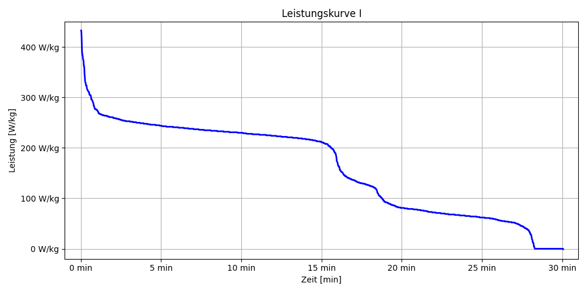

# Exercises for the course Programming 2
Diese Aufgabe wurde erledigt von:
- Julia Rössler
- Katharina Schroeder

## Exercise 1: Power Curve
In diesem Projekt wird eine sogenannte "Power Curve" (Leistungskurve) aus Aktivitätsdaten erstellt. Dabei werden die Leistungswerte (Power) aus der Datei activity.csv eingelesen, mit einem selbst implementierten Sortieralgorithmus (bubble_sort) sortiert und anschließend als Grafik dargestellt und gespeichert.

Um das Projekt auszuführen, müssen zunächst Python und das Python-Paketverwaltungstool pdm installiert werden (z.B. mit dem Befehl pip install pdm). Anschließend wird das Projekt mit dem Befehl pdm init initialisiert. Dabei gibt man grundlegende Informationen wie Projektname, Version, Beschreibung und Autor an.

Nach der Initialisierung werden die benötigten Abhängigkeiten, wie z. B. numpy, pandas und matplotlib, mit pdm add installiert. Das Projekt wird anschließend von GitHub geklont und man erhält die Dateien activity.csv und load_data.py.

Die Datei activity.csv enthält die gemessenen Leistungsdaten. Diese werden mit der Funktion in load_data.py eingelesen und in ein Dictionary umgewandelt. Die Datei sort.py enthält die selbst geschriebene Funktion bubble_sort, die die Leistungswerte sortiert.

Schließlich wird das Skript power_curve.py erstellt, das die sortierten Daten grafisch darstellt und als Bild speichert. Dadurch entsteht eine anschauliche Darstellung der Leistungskurve über die Zeit.

